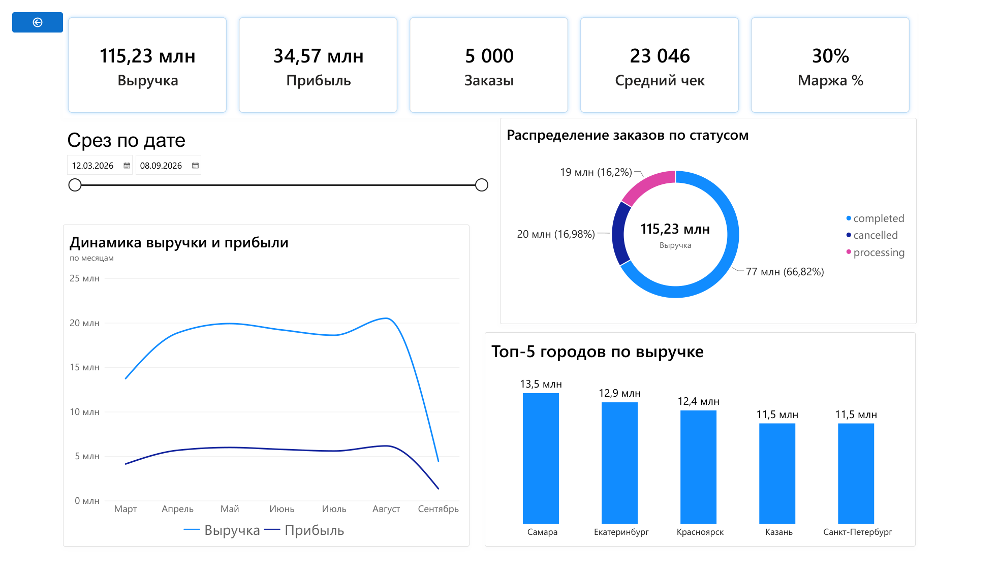
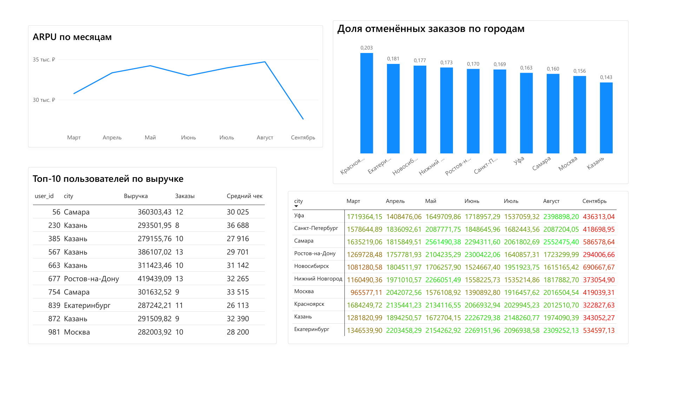

# 📊 Автоматизация отчетности интернет-магазина

**Стек:** Python (pandas) • Power BI (DAX) • Email (SMTP) • Планировщик задач Windows

---

## 🎯 Проблема

Ручной отчёт занимал **4 часа в неделю**, часто были ошибки в расчётах.
Данные лежали в 3 разных CSV-файлах и не были связаны между собой.
Отчёт формировался вручную в Excel — долго, скучно, с ошибками.

---

## 💡 Решение

Построен **полный ETL-конвейер** с автоматической доставкой:

1. **Python (pandas)** — ETL-скрипт объединяет 3 источника данных.
2. **Power BI (DAX)** — дашборд с 6 DAX-мерами и 2 страницами.
3. **Email (SMTP)** — ежедневный отчёт + алерты при аномалиях.
4. **Планировщик Windows** — автозапуск каждый день в 9:00.

---

## 🏗️ Архитектура

```
data/raw/ (3 CSV)
    ↓
etl_pipeline.py (Python + pandas)
    ↓
data/processed/orders_enriched.csv
    ↓
Power BI (дашборд, DAX-меры)
    ↓
email_sender.py → Email (PDF + алерты)
```

---

## 📈 Ключевые метрики (DAX)

| Метрика | Формула | Описание |
|---------|---------|----------|
| Total Revenue | `SUM(price)` | Общая выручка |
| Total Profit | `SUM(profit)` | Общая прибыль |
| Orders Count | `COUNTROWS()` | Количество заказов |
| Average Check | `AVERAGE(price)` | Средний чек |
| Margin % | `DIVIDE(profit, price)` | Маржинальность |
| ARPU | `DIVIDE(revenue, users)` | Выручка на пользователя |

---

## 📊 Дашборд

### Страница 1: «Общий обзор»

- 5 карточек: выручка, прибыль, заказы, средний чек, маржинальность
- Динамика выручки и прибыли по месяцам
- Распределение заказов по статусам
- Топ-5 городов по выручке



### Страница 2: «Детальный анализ»

- Матрица «Города × Месяцы»
- ARPU по месяцам
- Топ-10 клиентов по выручке
- Доля отмен по городам



---

## 📬 Автоматизация

### Ежедневный отчёт на email

Каждый день в 9:00 система автоматически:
- Обновляет данные через ETL.
- Проверяет аномалии.
- Отправляет email с ключевыми метриками.
- Раз в неделю — PDF-отчёт с дашбордом.

### Алерты при аномалиях

Если выручка падает больше чем на **20%** — приходит email с предупреждением.


---

## 🚀 Результаты

| Показатель | До | После |
|------------|-----|-------|
| Время на отчёт | 4 часа/нед | **5 минут** |
| Ошибки в расчётах | регулярно | **0** |
| Доступность данных | раз в неделю | **ежедневно** |
| Мониторинг аномалий | отсутствовал | **мгновенно** |

---

## 📂 Структура проекта

```
shop_automation_project/
├── data/
│   ├── raw/                    # Исходные CSV
│   └── processed/              # Обработанные данные
├── powerbi/
│   ├── shop_dashboard.pbix     # Файл Power BI
│   └── shop_dashboard.pdf      # PDF-версия
├── scripts/
│   ├── generate_data.py        # Генерация тестовых данных
│   ├── etl_pipeline.py         # ETL-конвейер
│   ├── email_sender.py         # Отправка email
│   └── check_anomalies.py      # Проверка аномалий
├── screenshots/                # Скриншоты дашборда
├── run_pipeline.bat            # Файл для Планировщика
└── README.md
```

---

## 🔧 Как запустить

### 1. Установить зависимости

```bash
pip install pandas faker yagmail
```

### 2. Сгенерировать тестовые данные

```bash
python scripts/generate_data.py
```

### 3. Запустить ETL + отправить email

```bash
python scripts/etl_pipeline.py
```

### 4. Открыть дашборд

- Открой `powerbi/shop_dashboard.pbix` в Power BI Desktop.
- Нажми **«Обновить»**.

### 5. Настроить автозапуск

- Создай задачу в **Планировщике задач Windows** на `run_pipeline.bat`.
